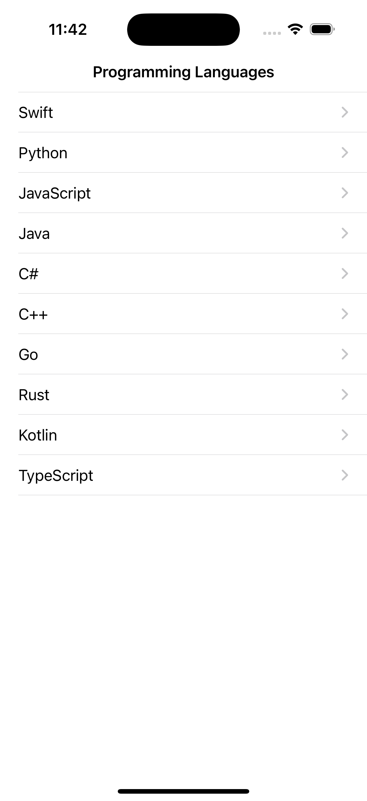
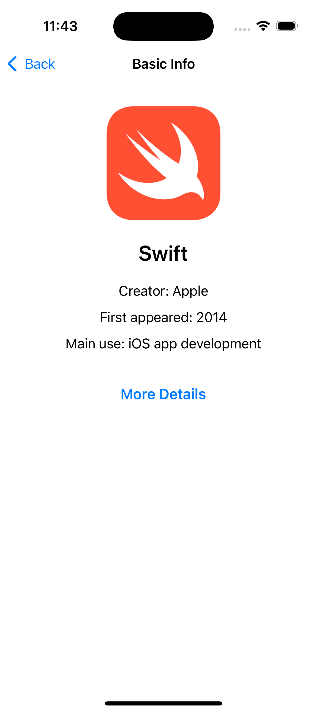
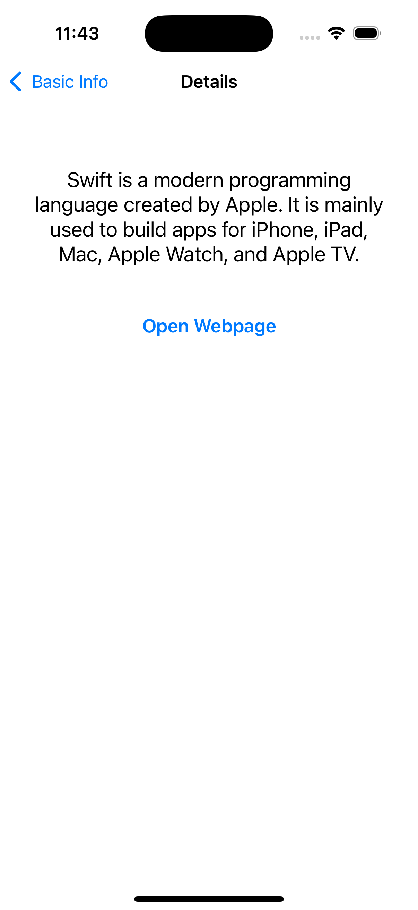
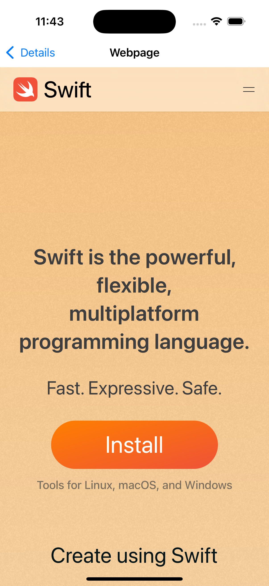

# ProgrammingLanguagesGuide

Simple iOS app that presents popular programming languages, their creator, first release year, main use, a short description, and the official website.

## Tech

- Swift
- UIKit
- `XMLParser`
- `WKWebView`

## Run

Open `ProgrammingLanguagesGuide.xcodeproj` in Xcode and run the app on a simulator or device.

## Screenshots

| List | Basic Info |
| --- | --- |
|  |  |

| Details | Webpage |
| --- | --- |
|  |  |
